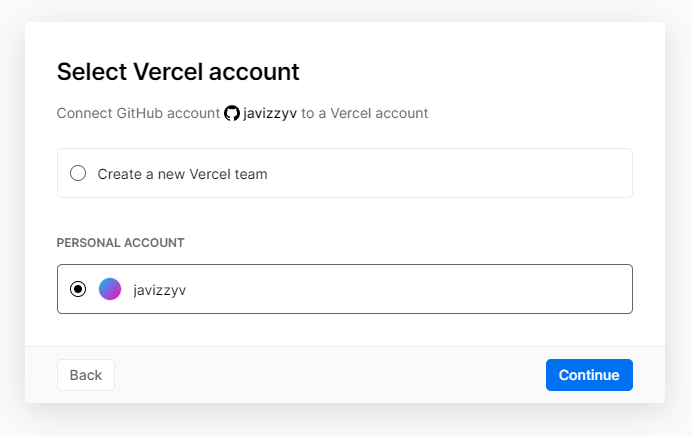
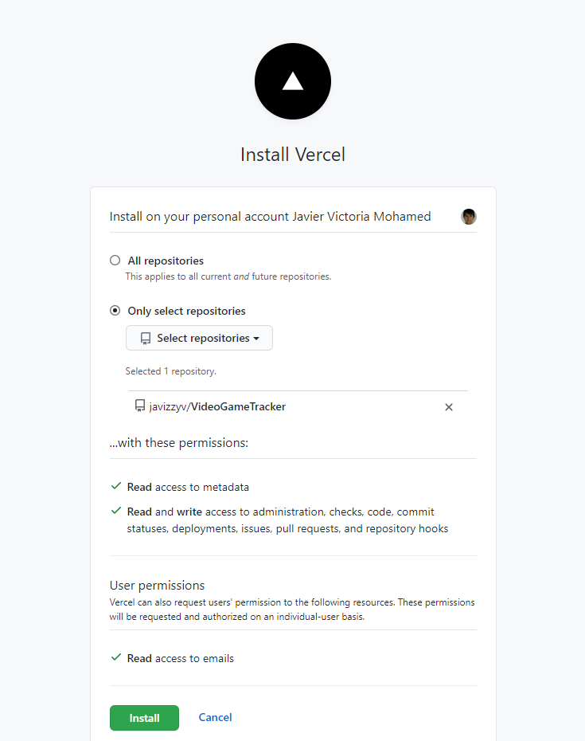
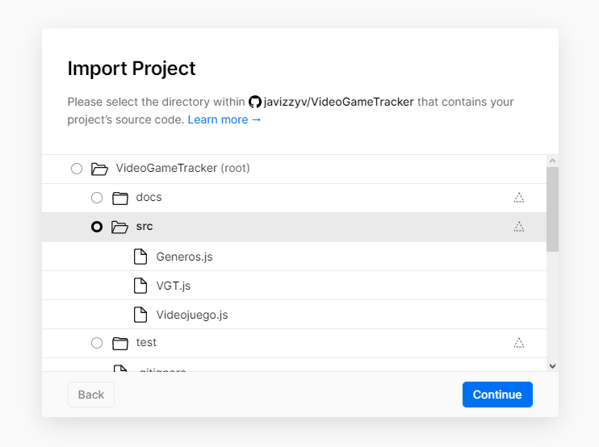
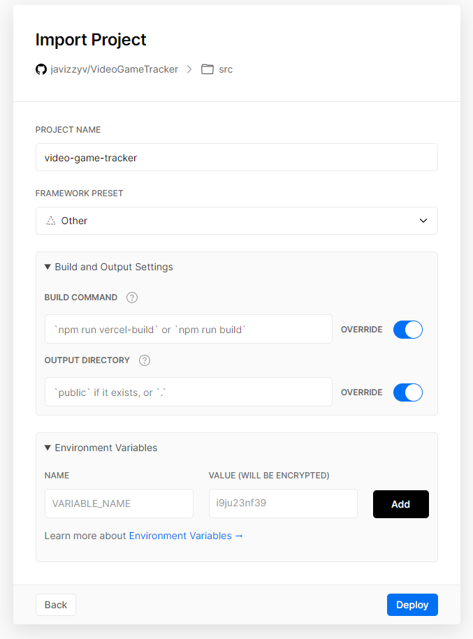

Primero, me hice una cuenta mediante mi cuenta de GitHub de la siguiente forma: 

Una vez hecha la cuenta lo que tenía que hacer era conectarla a la cuenta y a algún repositorio. Primero la conexión entre Vercel-GitHub:

Para seleccionar el repositorio que quería desplegar hice lo siguiente:

Selecciono la carpeta donde estará el código para poder navegar después del despliegue de forma interactiva, en este caso está seleccionado src pero había puesto root finalmente.

Y por último, se especifica el comando para la build, el directorio de despliegue y alguna variable de entorno en caso de que lo necesitemos.

Hecho esto, cada vez que se haga push en GitHub se volverá a hacer la build y nos ofrecerá la más actualizada que no ha fallado.