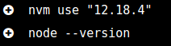
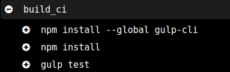

# Shippable

El archivo de configuración está aquí ---> [Shippable](/shippable.yml)

Para la configuración de este archivo he seguido el [tutorial oficial](http://docs.shippable.com/ci/nodejs-continuous-integration/) y a continuación explicaré cada línea.

## Explicación

```
language: nodejs
``` 
En esta parte indico que voy a usar Nodejs mediante `language`, esto hará que se instale nvm entre otras herramientas fundamentales para node como se ve a continuación:


``` 
node_js:
    - 12
    - 8
```

Aquí indico las versiones sobre las que quiero que se haga la build, poniendo 'lenguajeQueSeUse:' seguido de guiones de las versiones que quiera. La justificación de las mismas está más abajo.



Esto se hará para cada versión, en este caso para la 8 y la 12. También vemos que usa nvm, herramienta que se utiliza gracias a haber especificado el lenguaje en el primer apartado.


```
build:
    ci:
        - npm install --global gulp-cli
        - npm install
        - gulp test
```

Esto es lo que queremos que se haga durante la build, etiquetado con `build:`. En este apartado hay varias directrices entre las que está `ci` que es el que uso y el que se recomienda en la web oficial para instalar y realizar los test.
`npm install --global gulp-cli` hará que se instale gulp a para su ejecución posterior.
`npm install` hará que se instalen las dependencias, no se usa gulp install por fallos con el 'node_modules', tras haber probado 4 plugins diferentes de gulp para la ejecución de órdenes, los tres daban el mismo error. Revisando diversos foros todos recomendaban usar `npm install` con gulp así que he optado por hacerlo así.
`gulp test` hará que se ejecute 'mocha' para pasar los test.

Aquí se ve como se ejecuta:



## Versiones 

- **12:** He usado esta versión debido a que es desde donde de implementa 'ES6 modules' que hace falta para React, y como en un principio me había llamado la atención, he decidido ir viendo la compatibilidad con esta versión por si en un futuro lo uso.
- **8:** Esta es la versión mínima que debería soportar, debido a que es la que implementa las funciones 'async' las cuales uso en los test.

Esta información la he sacado de [este](https://tamalweb.com/which-nodejs-version) post.