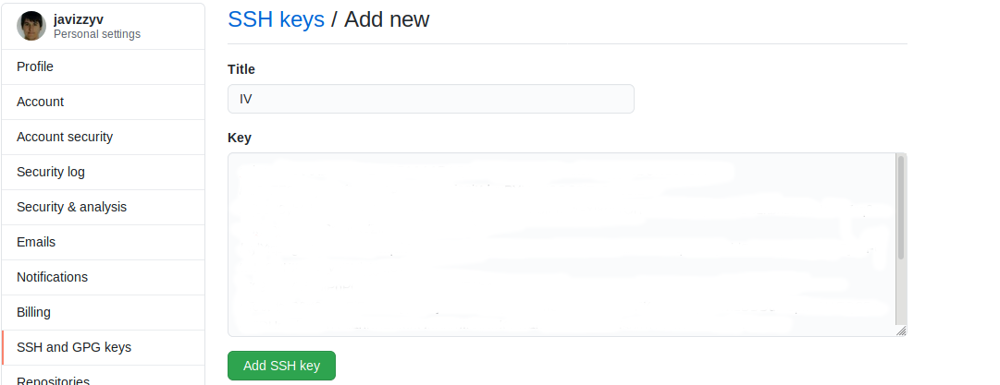

# Configuración de git y github con SSH
- Primero he generado un par de claves pública/privada en mi ordenador:

- Segundo, he copiado la clave pública generada con xclip

- Y por último he añadido una nueva clave en la web de GitHub de la siguiente forma:

De esta forma no hace falta logear cada vez que use git.