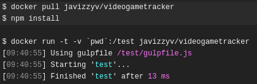

# Travis

El archivo de configuración está aquí ---> [Travis](/.travis.yml)

Para la configuración de este archivo he seguido el [tutorial oficial](https://docs.travis-ci.com/user/languages/javascript-with-nodejs/) y a continuación explicaré cada línea.

## Explicación

```
language: node_js
```

En esta parte indico que voy a usar Nodejs mediante `language`, esto hará que se instale nvm entre otras herramientas fundamentales para node como se ve a continuación:


```
services:
    - docker
```

Aquí indico que voy a usar docker para que se inicialice y no haya ningún problema como se ve aquí:


```
before_install:
    - docker pull javizzyv/videogametracker
```

En la etiqueta `before_install:` indico que necesito el contenedor de docker antes de instalar o ejecutar nada, y así se hace como se verá a continuación.


```
script:
    - docker run -t -v `pwd`:/test javizzyv/videogametracker
```

Este es el grueso, donde se ejecutará el contenedor docker y todo lo que haya especificado el mismo (install, test, y lo que se necesite para ello) como se ve aquí junto a la descarga previa:



Se usa finalmente `pwd` porque de otra forma daba error.

## Versiones 

Uso la versión que hay en el docker, en este caso la 12.18.4, porque es en la que me he basado desde el principio.